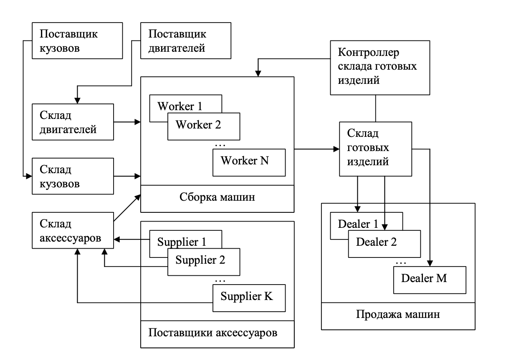

# ФИТ НГУ, курс ООП

## Многопоточное программирование. «Эмулятор работы фабрики»

### Постановка задачи

Создайте приложение, которое эмулирует работу фабрики по сборке автомобилей.

Автомобиль состоит из 3 частей: кузов, двигатель и аксессуары.

Автомобиль нужно собрать и отвезти на склад, откуда он поступает дилерам.

Процесс работы фабрики показан на картинке:


### Требования к программе

1. Все склады имеют ограниченный размер.
   Размеры складов, количество сборщиков, поставщиков и дилеров задаются в конфигурационном файле.
   Приложение должно иметь графический интерфейс (библиотека Swing), где можно наблюдать за работой фабрики и управлять процессом.
2. Каждый сборщик, поставщик и дилер работает в отдельном потоке.
   Для синхронизации используйте мониторы (notify(), notifyAll(), wait()).
   Ожидание в виде цикла недопустимо.
   Каждая деталь - это отдельный объект с уникальным идентификатором.
3. Поставщики деталей работают в отдельных потоках и поставляют одну деталь раз в N миллисекунд.
   Если склад деталей полон, поставщик ждет освобождения места (используя wait(), notify()).
   Скорость работы поставщиков регулируется ползунками (для каждого типа деталей).
   Интерфейс должен показывать количество деталей на складах и количество произведенных деталей.
4. Дилеры запрашивают со склада готовую машину раз в M миллисекунд.
   Скорость запросов регулируется ползунком в интерфейсе.
   Интерфейс должен показывать количество произведенных машин и количество машин на складе.
   При отправке машины дилеру информация о покупке записывается в лог (в файл) в виде строки:
   `<Time>: Dealer <Number>: Auto <ID> (Body: <ID>, Motor: <ID>, Accessory: <ID>)`
5. Включение/отключение лога контролируется параметром в конфигурационном файле.
6. Поток контроллера склада готовой продукции просыпается при отправке машины со склада.
   Он анализирует состояние склада и передает запрос на изготовление новых машин на фабрику.
7. На фабрике работают несколько сборщиков в рамках ThreadPool.
   Задачи для ThreadPool - это запросы на создание новых машин.
   Сборщик берет по одной детали с соответствующих складов для сборки машины.

   Если на складе нет нужной детали, поток ждет поставки.
   Собрав машину, рабочий создает новый объект и отправляет его на склад готовой продукции.
   Если склад полон, рабочий ждет освобождения места.
   Интерфейс должен показывать количество сделанных машин и количество задач в очереди ThreadPool.

8. Конфигурационный файл должен содержать настройки для всех складов и потоков.
   Примерный список параметров:

   ```plain
   StorageBodySize=100
   StorageMotorSize=100
   StorageAccessorySize=100
   StorageAutoSize=100
   AccessorySuppliers=5
   Workers=10
   Dealers=20
   LogSale=true
   ```

### Основные требования

1. Удовлетворить все уловия выше.
2. Создать javadoc документацию для всех классов и методов.
3. Написать readme-файл с инструкцией по установке, запуску калькулятора.
4. Добавить unit тесты для оценки работы фабрики.

### Расширенные требования (на автомат)

1. Реализовать задаваемое время работы диллеров и поставщиков деталей.
2. Реализовать возможность shutdown фабрики с сохранением работы в файл и последущим запуском фабрики из сохраненного состояния.

## Особенности реализации

- Информацию о потоках и ThreadPool можно найти на страницах:
  http://ccfit.nsu.ru/~rylov/java_lections/index.html (Лекции №8, №9).
  http://ccfit.nsu.ru/~deviv/ (ООП -> Java -> Документация -> Thinking in Java).
- Классы объектной модели (деталь, склад, поставщик, сборщик и т.д.) не должны зависеть от библиотеки Swing.
- ThreadPool нужно реализовать в отдельном пакете. Он должен выполнять абстрактные задачи и не зависеть от реализации (задача на сборку машины). Используйте примитивы синхронизации Java (synchronized/notify/notifyAll).
- Программа должна корректно завершаться. При закрытии окна все потоки должны корректно прерываться, и лог-файл закрываться.